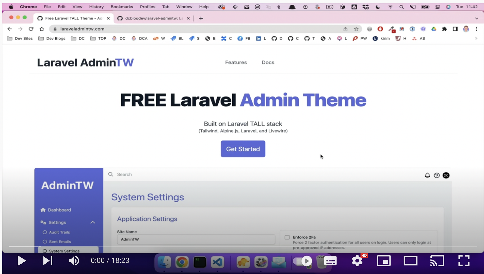

<p align="center"></p>

## Laravel AdminTW

Laravel AdminTW is a TALL admin theme.

Includes:
- 2FA
- Audit Trails
- Sent emails
- System Settings
- Multiple Users
- Roles and Permissions
- Tests

Laravel AdminTW supports both light and dark mode based on the users OS.

Provided are blade and Laravel Livewire components for common layout / UI elements and a complete test suite (Pest PHP).

- [Video Tour](#video-tour)
- [Install](#install)
- [Documentation](#documentation)


## Video Tour
<a href="https://www.youtube.com/watch?v=ehLx-jO1LF0"></a>

or watch on [YouTube](https://www.youtube.com/watch?v=ehLx-jO1LF0)

## Install

Install a fresh copy of Laravel then use require this package with composer:

```bash
composer require dcblogdev/laravel-admintw
```
Then install using the command:

```bash
php artisan admintw:install
```

Run composer

```bash
composer update
```

>Ensure you've updated .env before migrating.

Migrate the database

```
php artisan migrate
```

Seed the database

```
php artisan db:seed
```

Link Storage to public

```
php artisan storage:link
```

To compile your assets:

```bash
npm install && npm run dev
```

Run the tests by running PestPHP

```bash
vendor/bin/pest
```

## Documentation

Complete docs at [laraveladmintw.com](https://laraveladmintw.com)

## Contributing

Contributions are welcome and will be fully credited.

## Pull Requests

- **Document any change in behaviour** - Make sure the `readme.md` and any other relevant documentation are kept up-to-date.

- **One pull request per feature** - If you want to do more than one thing, send multiple pull requests.

## Security

If you discover any security related issues, please email dave@dcblog.dev email instead of using the issue tracker.

## License

Laravel AdminTW is open-sourced software licensed under the [MIT license](https://opensource.org/licenses/MIT).
